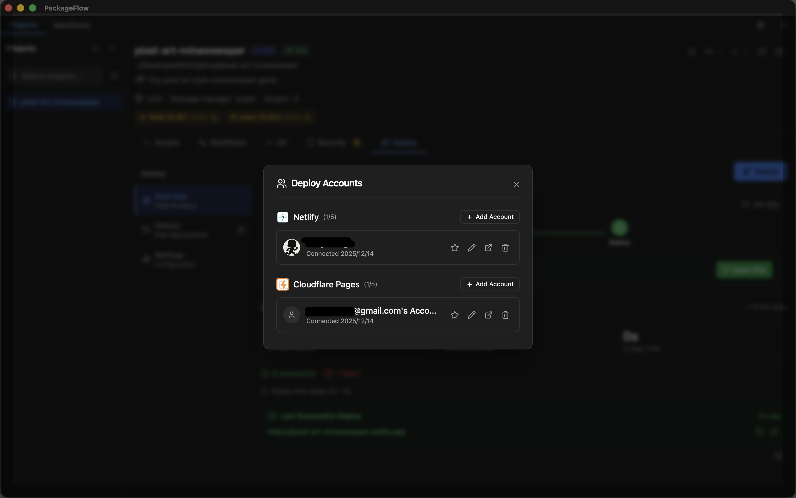
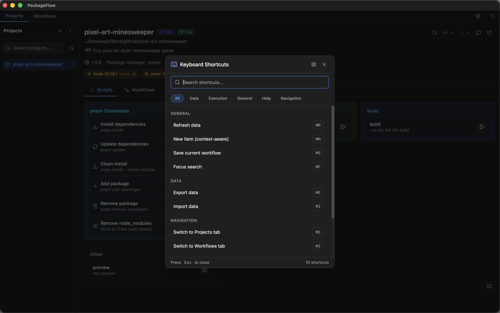

<p align="center">
  
</p>

<h1 align="center">PackageFlow</h1>

<p align="center">
  <strong>🚀 Stop juggling terminals.</strong><br/>
  <sub>Run scripts, manage your project, and deploy with preview links — all in one beautiful app.</sub>
</p>

<p align="center">
  <a href="https://github.com/runkids/PackageFlow/releases">
    
  </a>
  <a href="https://github.com/runkids/PackageFlow/stargazers">
    
  </a>
  <a href="https://github.com/runkids/PackageFlow/blob/main/LICENSE">
    
  </a>
  
</p>

<p align="center">
  
</p>

<p align="center">
  <a href="https://github.com/runkids/PackageFlow/releases">📥 Download</a> •
  <a href="#-features">✨ Features</a> •
  <a href="#-documentation">📚 Docs</a> •
  <a href="#-screenshots">📸 Screenshots</a> •
  <a href="#-roadmap">🗺️ Roadmap</a> •
  <a href="#-faq">❓ FAQ</a>
</p>

<p align="center">
  <a href="./README.zh-TW.md">繁體中文</a> •
  <a href="./README.zh-CN.md">简体中文</a>
</p>

---

## ✨ What is PackageFlow?

**PackageFlow is the app you open instead of your terminal.**

It turns your project into a visual control center —  
run scripts, manage Git, switch worktrees, and deploy with preview links  
**without memorizing commands or juggling tools**.

Built for **vibe coding**:  
stay in flow, not in the terminal.

Powered by **Tauri + Rust** for a tiny binary and instant startup.

## 🎬 Quick Start

1. **Download** → [Get PackageFlow for macOS](https://github.com/runkids/PackageFlow/releases)
2. **Open a project** → Drag any folder with `package.json` into the app
3. **Click to run** → Scripts, workflows, deploys — all one click away

> 💡 Tip: Press <kbd>Cmd</kbd> + <kbd>K</kbd> to instantly switch worktrees

## ✨ Features

| | Feature | What it feels like |
|:--:|--|--|
| 🎯 | **One-Click Scripts** | Run npm scripts like buttons — live terminal included |
| ⚡ | **Visual Workflow** | Build flows with drag-and-drop steps |
| 🚀 | **Instant Deploy** | One click → preview link (Netlify / Cloudflare) |
| 📦 | **Monorepo Ready** | Nx / Turborepo auto-detected |
| 🔀 | **Git, Visualized** | Commit, branch, stash, diff — no CLI gymnastics |
| 🌳 | **Worktree Magic** | See, switch, and resume worktrees instantly |
| 🔧 | **Toolchain Smart** | Detect Volta / Corepack conflicts automatically |
| 🛡️ | **Security Scan** | Visual npm audit with one-click fixes |

---

## 📚 Documentation

Learn more about each feature in our detailed documentation:

| Feature | Description |
|---------|-------------|
| [Getting Started](./docs/getting-started.md) | Installation and first steps |
| [Project Management](./docs/features/project-management.md) | Import and manage projects |
| [One-Click Scripts](./docs/features/one-click-scripts.md) | Run npm scripts with live terminal |
| [Visual Workflow](./docs/features/visual-workflow.md) | Drag-and-drop automation |
| [Monorepo Support](./docs/features/monorepo-support.md) | Nx, Turbo, Lerna integration |
| [Git Integration](./docs/features/git-integration.md) | Visual Git operations |
| [Worktree Management](./docs/features/worktree-management.md) | Quick worktree switching |
| [One-Click Deploy](./docs/features/one-click-deploy.md) | Deploy to Netlify/Cloudflare |
| [Security Audit](./docs/features/security-audit.md) | Vulnerability scanning |
| [AI Integration](./docs/features/ai-integration.md) | Multi-provider AI support |
| [MCP Server](./docs/features/mcp-server.md) | AI tool integration |
| [Webhooks](./docs/features/webhooks.md) | Incoming/outgoing automation |
| [Toolchain Management](./docs/features/toolchain-management.md) | Node.js version management |
| [Keyboard Shortcuts](./docs/features/keyboard-shortcuts.md) | Complete shortcut reference |

📖 [Full Documentation Index](./docs/README.md)

---

## 🤖 AI-Native (Coming Soon)

PackageFlow is becoming **AI-first**.

- 🧠 **AI-assisted workflows** — explain, generate, and fix scripts
- 🔌 **MCP Server support** — let AI tools control PackageFlow
- 🤖 **Local-first AI** — no cloud lock-in, your code stays local

> Think:  
> **“Claude, deploy my feature branch.”**  
> **“Fix the failing script and rerun.”**

---


## 📸 Screenshots

<p align="center">
  
  <br/>
  <em>🤖 Commit message generated by AI</em>
</p>

<p align="center">
  
  <br/>
  <em>👆 One-click deploy, instant preview link</em>
</p>

<details>
<summary>🎯 Projects + Scripts</summary>
<br/>

</details>

<details>
<summary>📦 Monorepo Action</summary>
<br/>

</details>

<details>
<summary>🔗 Dependency Graph</summary>
<br/>

</details>

<details>
<summary>💻 Terminals</summary>
<br/>

</details>

<details>
<summary>🔀 Git Integration</summary>
<br/>

</details>

<details>
<summary>📋 Step Templates</summary>
<br/>

</details>

<details>
<summary>🛡️ Security Audit</summary>
<br/>

</details>

<details>
<summary>🔌 Webhooks</summary>
<br/>

</details>

<details>
<summary>⚡ Visual Workflow</summary>
<br/>

</details>

<details>
<summary>🚀 Deploy Accounts</summary>
<br/>

</details>

<details>
<summary>⌨️ Keyboard Shortcuts</summary>
<br/>

</details>

## 📦 Installation

### Homebrew (macOS)

```bash
brew tap runkids/tap
brew install --cask packageflow
```

#### Upgrade

```bash
brew update
brew upgrade --cask packageflow
```

### Manual Download

Download the latest release from the [Releases](https://github.com/runkids/PackageFlow/releases) page.

## 🗺️ Roadmap

We're actively working on these features:

- [ ] 🪟 **Windows Support** — Cross-platform expansion
- [ ] 🐧 **Linux Support** — Complete desktop coverage
- [ ] 🤖 **AI Integration** — Local LLM & AI CLI (Claude Code, Codex, Gemini)
- [ ] 🔌 **MCP Server** — Let AI tools control PackageFlow
- [ ] 📦 **Plugin System** — Custom extensions

> 💡 Have a feature idea? [Open an issue!](https://github.com/runkids/PackageFlow/issues)

## ❓ FAQ

<details>
<summary><strong>Do I need to be a hardcore engineer?</strong></summary>
<br/>

No.

If your project has a `package.json`, you can use PackageFlow.
No command memorization. No terminal juggling. Just click and go.

</details>

<details>
<summary><strong>How is this different from VS Code terminal?</strong></summary>
<br/>

PackageFlow is about flow:

- Everything visible at a glance

- One-click actions

- Visual workflows

- Built-in deploy previews

</details>

<details>
<summary><strong>Is my data safe?</strong></summary>
<br/>

100% local-first.
All data stays on your machine.
No tracking. No cloud dependency.

</details>

## 🛠 Development

### Prerequisites

- Node.js 18+
- Rust 1.70+
- pnpm

### Setup

```bash
# Clone the repository
git clone https://github.com/runkids/PackageFlow.git
cd PackageFlow

# Install dependencies
pnpm install

# Start Vite (web UI)
pnpm dev

# Start the desktop app
pnpm dev:tauri
```

### Build

```bash
# Build web assets
pnpm build

# Build the desktop app (dmg)
pnpm build:tauri
```

## 🤝 Contributing

We welcome contributions! Please see our [Contributing Guide](CONTRIBUTING.md) for details.

### Ways to Contribute

- 🐛 Report bugs and request features via [Issues](https://github.com/runkids/PackageFlow/issues)
- 🔧 Submit pull requests for bug fixes or new features
- 📝 Improve documentation
- 🔄 Share your workflow templates

### Development Guidelines

1. Fork the repository
2. Create a feature branch (`git checkout -b feature/amazing-feature`)
3. Commit your changes (`git commit -m 'Add amazing feature'`)
4. Push to the branch (`git push origin feature/amazing-feature`)
5. Open a Pull Request

## ⭐ Star History

<p align="center">
  <a href="https://star-history.com/#runkids/PackageFlow&Date">
    
  </a>
</p>

## 📄 License

This project is licensed under the MIT License - see the [LICENSE](LICENSE) file for details.

## 🙏 Acknowledgments

- [Tauri](https://tauri.app/) — Amazing cross-platform framework
- [React Flow](https://reactflow.dev/) — Workflow visualization
- [Lucide](https://lucide.dev/) — Beautiful icons
- [Claude Code](https://claude.ai/code) — AI-powered development assistance

---

<p align="center">
  <strong>Like this project?</strong><br/>
  ⭐ Star us = Huge support!<br/><br/>
  <a href="https://github.com/runkids/PackageFlow">
    
  </a>
</p>

<p align="center">
  Made with ❤️ by <a href="https://github.com/runkids">runkids</a>
</p>
