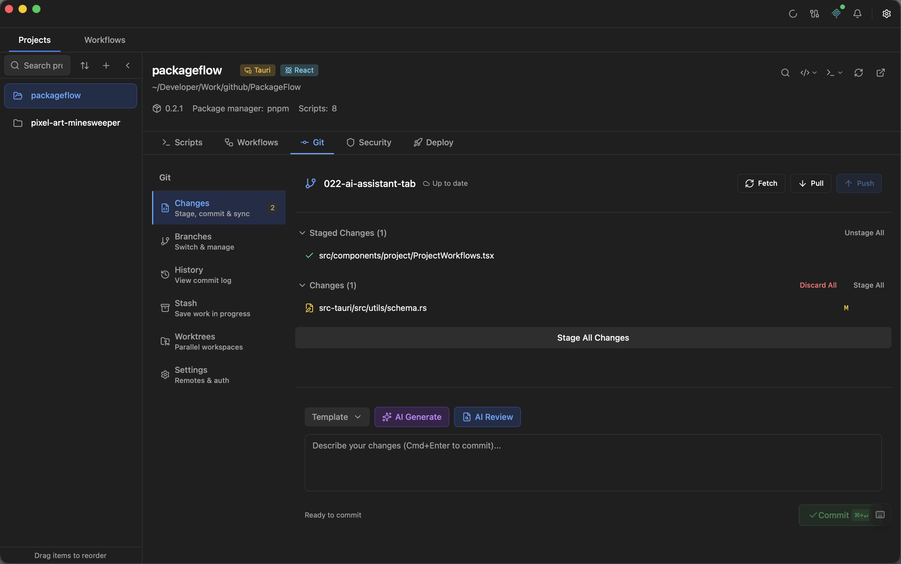

# Git Integration

Visual Git operations without leaving PackageFlow. Stage, commit, branch, and diff — all without CLI gymnastics.

## Overview

The Git panel provides a complete interface for common Git operations:

- File staging and unstaging
- Commit creation
- Branch management
- Diff viewing
- Stash operations

  

<!-- TODO: Add a close-up screenshot showing staged/modified/untracked sections. -->

## Git Status View

### File States

The status view shows all changed files organized by state:

| Section | Description |
|---------|-------------|
| **Staged** | Files ready to commit |
| **Modified** | Changed but not staged |
| **Untracked** | New files not in Git |
| **Conflicted** | Files with merge conflicts |

<!-- TODO: Add screenshot of file status sections -->

### File Actions

For each file, you can:

- **Stage**: Add to staging area (click `+`)
- **Unstage**: Remove from staging (click `-`)
- **Discard**: Revert changes (click `↩`)
- **View Diff**: See what changed

## Staging Files

### Stage Single File

Click the `+` button next to any modified or untracked file.

### Stage All

Click **Stage All** to add all changes at once.

### Partial Staging

For more control:
1. Click on a file to view its diff
2. Select specific hunks to stage
3. Stage only what you need

<!-- TODO: Add gif of partial staging -->

## Committing

### Creating a Commit

1. Stage your changes
2. Enter a commit message
3. Click **Commit**

<!-- TODO: Add screenshot of commit form -->

### AI-Generated Messages

PackageFlow can generate commit messages using AI:

1. Stage your changes
2. Click the **AI** button next to the message input
3. Review the generated message
4. Edit if needed, then commit

See [AI Integration](./ai-integration.md) for setup.

<!-- TODO: Add screenshot of AI commit message generation -->

### Commit Guidelines

PackageFlow shows a character count and warns if your message:
- Is too short (less than 10 characters)
- Has a very long first line (over 72 characters)

## Diff Viewer

### Unified View

See changes in a single-column format with:
- Red lines for deletions
- Green lines for additions
- Line numbers for reference

<!-- TODO: Add screenshot of unified diff view -->

### Split View

Compare old and new versions side by side:

1. Click **Split** in the diff toolbar
2. Left side shows the original
3. Right side shows your changes

<!-- TODO: Add screenshot of split diff view -->

### Syntax Highlighting

Diffs are syntax-highlighted based on file type for easier reading.

### Large Files

PackageFlow uses virtualization for large diffs, keeping performance smooth even with thousands of lines.

## Branch Operations

### View Branches

See all local and remote branches in the branch panel.

<!-- TODO: Add screenshot of branch list -->

### Create Branch

1. Click **New Branch**
2. Enter the branch name
3. Choose the base branch
4. Click **Create**

### Switch Branch

Click on any branch to switch to it. PackageFlow will:
- Warn if you have uncommitted changes
- Offer to stash or discard changes

### Delete Branch

1. Right-click on a branch
2. Select **Delete**
3. Confirm the deletion

> Note: You cannot delete the currently checked-out branch.

## Stash Operations

### Create Stash

1. Make some changes
2. Click **Stash** in the Git panel
3. Optionally add a message
4. Your changes are saved

### Apply Stash

1. View the stash list
2. Click on a stash to preview
3. Click **Apply** to restore changes
4. Choose to keep or drop the stash

<!-- TODO: Add screenshot of stash list -->

### Drop Stash

1. Right-click on a stash
2. Select **Drop**
3. Confirm deletion

## Pull and Push

### Pull Changes

Click **Pull** to fetch and merge remote changes.

- PackageFlow shows if you're behind the remote
- Conflicts are highlighted in the status view

### Push Changes

Click **Push** to upload your commits.

- Shows the number of commits to push
- Warns if the remote has new commits

<!-- TODO: Add screenshot of push/pull buttons with status -->

## Commit History

View the project's commit history:

1. Click **History** in the Git panel
2. See recent commits with:
   - Commit message
   - Author
   - Date
   - SHA

<!-- TODO: Add screenshot of commit history -->

## Tips

1. **Commit often**: Small, focused commits are easier to review and revert
2. **Use AI messages**: Let AI draft, then refine
3. **Review diffs**: Always check what you're committing
4. **Stash before switching**: Don't lose work when changing branches
5. **Pull before push**: Avoid conflicts by staying up to date
