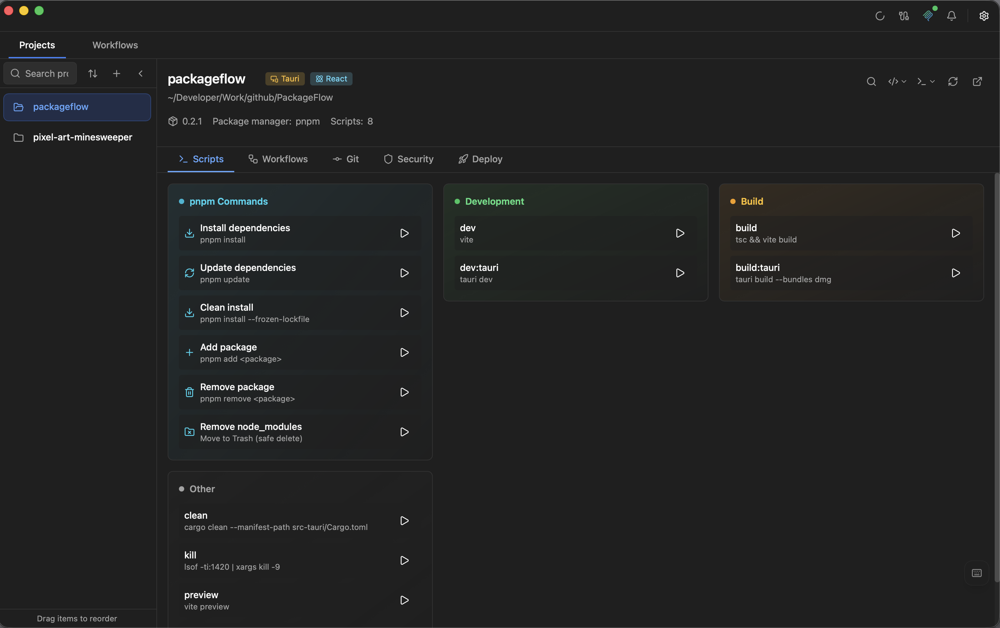
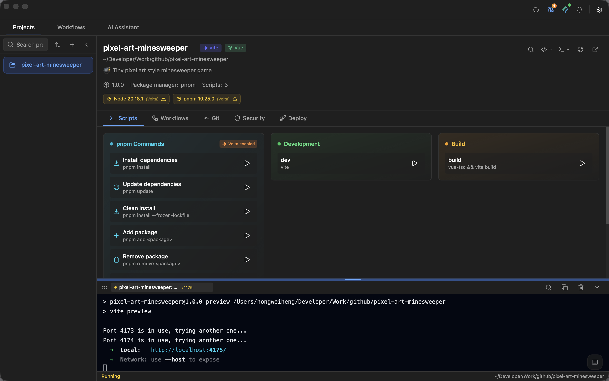

# Getting Started

This guide will help you install PackageFlow and get started with your first project.

PackageFlow is an AI-driven `package.json` project manager: import a folder once, then run scripts, manage Git/worktrees, automate workflows, and (optionally) let your AI tool control actions via MCP.

## Installation

### Homebrew (Recommended)

The easiest way to install PackageFlow on macOS:

```bash
brew tap runkids/tap
brew install --cask packageflow
```

#### Upgrading

```bash
brew update
brew upgrade --cask packageflow
```

### Manual Download

1. Go to the [Releases](https://github.com/runkids/PackageFlow/releases) page
2. Download the latest `.dmg` file
3. Open the DMG and drag PackageFlow to your Applications folder
4. Launch PackageFlow from Applications

## First Launch

When you first open PackageFlow, you'll see an empty project list.

## Importing Your First Project

There are two ways to add a project:

### Method 1: Drag and Drop

Simply drag any folder containing a `package.json` file into the PackageFlow window.

### Method 2: Click to Import

1. Click the **Import Project** button
2. Select a folder containing `package.json`
3. PackageFlow will scan and import the project

## Understanding the Interface

Once you've imported a project, you'll see:

### Main Areas

1. **Sidebar** - Project list and navigation
2. **Script Cards** - All npm scripts as clickable buttons
3. **Terminal Panel** - Live output from running scripts
4. **Status Bar** - Quick actions and system status

<p align="center">
  
</p>

## Running Your First Script

1. Click on a project in the sidebar
2. Find the script you want to run (e.g., `dev`, `build`, `test`)
3. Click the script card
4. Watch the output in the terminal panel

<p align="center">
  
</p>

## Key Shortcuts

| Shortcut | Action |
|----------|--------|
| <kbd>Cmd</kbd> + <kbd>K</kbd> | Quick switch worktrees |
| <kbd>Cmd</kbd> + <kbd>1</kbd> | Projects tab |
| <kbd>Cmd</kbd> + <kbd>2</kbd> | Workflows tab |
| <kbd>Cmd</kbd> + <kbd>,</kbd> | Settings |
| <kbd>Cmd</kbd> + <kbd>/</kbd> | Show all shortcuts |

## Next Steps

Now that you're set up, explore these features:

- [One-Click Scripts](./features/one-click-scripts.md) - Master script execution
- [Visual Workflow](./features/visual-workflow.md) - Automate multi-step tasks
- [Git Integration](./features/git-integration.md) - Visual Git operations
- [One-Click Deploy](./features/one-click-deploy.md) - Deploy with preview links
- [MCP Server](./features/mcp-server.md) - Let AI tools safely run actions for you
